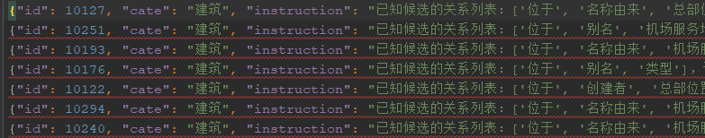

### 1、逐行加载下面格式的文件并写入列表



```python
file_ls = []
with open('../cache/data/train.json', 'r', encoding='UTF-8') as f:
    for line in f.readlines():
        li = json.loads(line)
        file_ls.append(li)
```

### 2、逐行写回上面格式的文件

```python
json_list = []

for dfl in dev_file_ls:
    json_list.append(json.dumps(dfl, ensure_ascii=False))  # ensure_ascii保证不被转成乱码

with open('../cache/data/dev_split.json', 'w', encoding="UTF-8") as f:
    for i in json_list:
        f.write(i)
        f.write('\n')
```